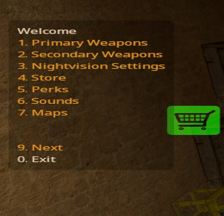

# Pro Equip

A feature-rich equipment menu and equipment manager plugin for Counter-Strike Source and Sourcemod.  Currently does not support CSGO (if you would like to help make it support CSGO let me know).

Easy installation - no database required (but can be added to allow custom menu entries).  See [installation](install.md) for more.

## Contents

- [Installation](#installation)
- [Screenshots](screenshots.md)
- [Description](#description)
- [Features](#features)
- [Usage](#usage)
    - [player commands](#player-commands)
    - [admin commands](#admin-commands)
    - [console commands](#console-commands)
- [Todo](#future-plans)

## Installation

See [Installation](install.md) for detailed installation instructions.

## Screenshots

Example menu (items 4-7 are server-specific custom menu entries):

See [screenshots](screenshots.md) for more.

## Description

Manages equipment and weapons for players and gives admins control over available weapons and equipment settings mid-game, without reloading.

This is intended to be a drop-in replacement for [CSSDM](https://www.bailopan.net/cssdm/)'s `dm_equipment`.
This should work without CSSDM, however I have not tested this.

## Features

- Equipment menu that can be accessed through: `guns`, `rifles`, `pistols` in chat (or with commands like `/rifles`, `!rifles`)

- Admin commands to modify weapons and equipment settings without reloading.  Described in more detail below.

- Works with [ProNightvision](https://github.com/vishusandy/ProNightvision).  If installed, it adds a `!setnv` admin command and a menu option for nightvision settings.

- Ability to add custom menu items (requires recompiling)

- Can set silencer settings to always add a silencer on respawn

- Supports existing CSSDM config files (including per-map configs).  The config files are extended *slightly* to add configs to specify an amount for smokegrenades and hegrenades instead of just yes/no.

- Provides an extensive set of natives to allow modifying equipment and weapons.

## Usage

A menu will appear when joining.  The menu can be used to choose your weapons.  Closing the menu will display a help message in chat.

### Player Commands

Players can type the following commands in chat (can be used with or without chat command prefixes):

- `guns`, `menu`, or `weapons` to display the main menu.

- `rifles` will bring up just the rifle menu

- `pistols` will show the pistols menu.

### Admin Commands

Each admin command has additional documentation

- [`!equip`](equip_cmd.md): modify equipment preferences and weapon availability

- [`!give`](give_cmd.md): give/remove weapons from players

- [`!sethp`](sethp_cmd.md) or `!hp`: modify the hp of a player

- [`!setnv`](setnv_cmd.md): if [ProNightvision](https://github.com/vishusandy/ProNightvision) is running this command can be used to turn on/off nightvision and set filter preferences

### Console Commands

- `equip_server`: the same as `!equip` but works from the console

- `give_server`: the same as `!give` but works from the console

- `dbg_equip dump`: dumps debug info to the log file.  The location of this file can be found in `include/pro_equip/constants.inc`.

### Future Plans

- Add support for CSGO
- Add support for translations
- Allow `!equip` to set infinite ammo and reserve ammo amount for rifles/pistols and grenades
- Allow `!setnv` to specify an intensity
- Maybe: refilling reserve ammo when empty
- Maybe: per-player weapon availability instead of just players and/or bots
