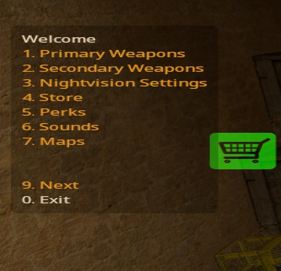
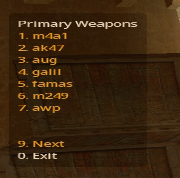

# Pro Equip

A feature-rich equipment menu and equipment manager plugin for Counter-Strike Source and Sourcemod.  Currently does not support CSGO (if you would like to help make it support CSGO let me know).

## Screenshots

Main menu:


Rifles menu:


## Description

Manages equipment and weapons for players and gives admins control over available weapons and equipment settings mid-game, without reloading.

This is intended to be a drop-in replacement for [CSSDM](https://www.bailopan.net/cssdm/)'s `dm_equipment`.
This should work without CSSDM, however I have not tested this.

## Features

- Equipment menu that can be accessed through: `guns`, `rifles`, `pistols` in chat (or with commands like `/rifles`, `!rifles`)

- Admin commands to modify weapons and equipment settings without reloading.  Described in more detail below.

- Works with [ProNightvision](https://github.com/vishusandy/ProNightvision).  If installed, it adds a `!setnv` admin command and a menu option for nightvision settings.

- Ability to add custom menu items (requires recompiling)

- Can set silencer settings to always add a silencer on respawn

- Supports existing CSSDM config files (including per-map configs).  The config files are extended *slightly* to add configs to specify an amount for smokegrenades and hegrenades instead of just yes/no.

- Provides an extensive set of natives to allow modifying equipment and weapons.

## Usage

A menu will appear when joining.  The menu can be used to choose your weapons.  Closing the menu will display a help message in chat.

### Player Commands

Players can type the following commands in chat (can be used with or without chat command prefixes):

- `guns`, `menu`, or `weapons` to display the main menu.

- `rifles` will bring up just the rifle menu

- `pistols` will show the pistols menu.

### Admin Commands

Each admin command has additional documentation

- [`!equip`](equip_cmd.md): modify equipment preferences and weapon availability

- [`!give`](give_cmd.md): give/remove weapons from players

- [`!sethp`](sethp_cmd.md) or `!hp`: modify the hp of a player

- [`!setnv`](setnv_cmd.md): if [ProNightvision](https://github.com/vishusandy/ProNightvision) is running this command can be used to turn on/off nightvision and set filter preferences

### Console Commands

- `equip_server`: the same as `!equip` but works from the console

- `give_server`: the same as `!give` but works from the console

- `dbg_equip dump`: dumps debug info to the log file.  The location of this file can be found in `include/pro_equip/constants.inc`.

## Installation

Installation is pretty simple.  

1. If using CSSDM, disable the `dm_equipment` plugin first.

2. Copy the .smx file to the plugins folder (e.g. `cstrike/addons/sourcemod/plugins`) and load the file using `sm plugins load`.

3. Optionally add CSSDM config files.  It can work without any config files, but using them is recommended.

4. Optionally install [ProNightvision](https://github.com/vishusandy/ProNightvision)

5. Optionally add custom menu entries (see below)

### Config files

Config files are not required for the plugin to work, however without any config files you can't specify default weapon/equipment settings.  An example of the config format can be found [here](cssdm.equip.txt).

Config files:

- Global settings
  
  - `cstrike/cfg/cssdm/cssdm.equip.txt`

- Map-specific settings
  
  - `cstrike/cfg/cssdm/maps/<map_name>.equip.txt`

Note: If using CSSDM it is recommended to set `cssdm_refill_ammo "0"` in `cstrike/cfg/cssdm/cssdm.cfg` to allow infinite grenades to work properly.

### Optional - Custom Menu Entries

Optionally, custom menu entries can added and will be displayed in the main menu. Each menu entry will have a command associated with it; after selecting the menu entry the command will be executed with the specified client ID.

Custom menu entries are stored in a database.  You can skip this step if no custom menu entries are desired.  You can add up to 30 custom menu entries (that number seems gratuitous, but maybe there's a use case it).

How to add custom menu entries:

1. To add custom menu entries add the following to`cstrike/addons/sourcemod/configs/databases.cfg`:

```
  "pro_menu"
    {
        "driver"    "default"
        "host"      "<hostname>"
        "database"  "<database>"
        "user"      "<username>"
        "pass"      "<password>"
    }
```

2. After starting the plugin the table will be automatically created (only tested with MySQL but should work with Postgres and SQLite too).  If you have issues see: [Database Setup](db_setup.md)

3. Add rows consisting of:
   
   - an auto-incremented `id`
   
   - an `ordering` field to specify the arbitrary order to sort the menu items by (lowest are displayed first)
   
   - a `title` that will be displayed in the menu
   
   - a `value` which is a unique value tied to that entry
   
   - a `cmd` which will be the command that gets executed (do not include a ! or /)
   
   - an optional message that gets printed to chat the first time the user selects the menu item (useful for learning purposes). Leave blank or set to null to not show a message.  It is recommended to type a short message 

### Future Plans

- Add support for CSGO
- Add support for translations
- Allow `!equip` to set infinite ammo and reserve ammo amount for rifles/pistols and grenades
- Allow `!setnv` to specify an intensity
- Maybe: refilling reserve ammo when empty
- Maybe: per-player weapon availability instead of just players and/or bots
